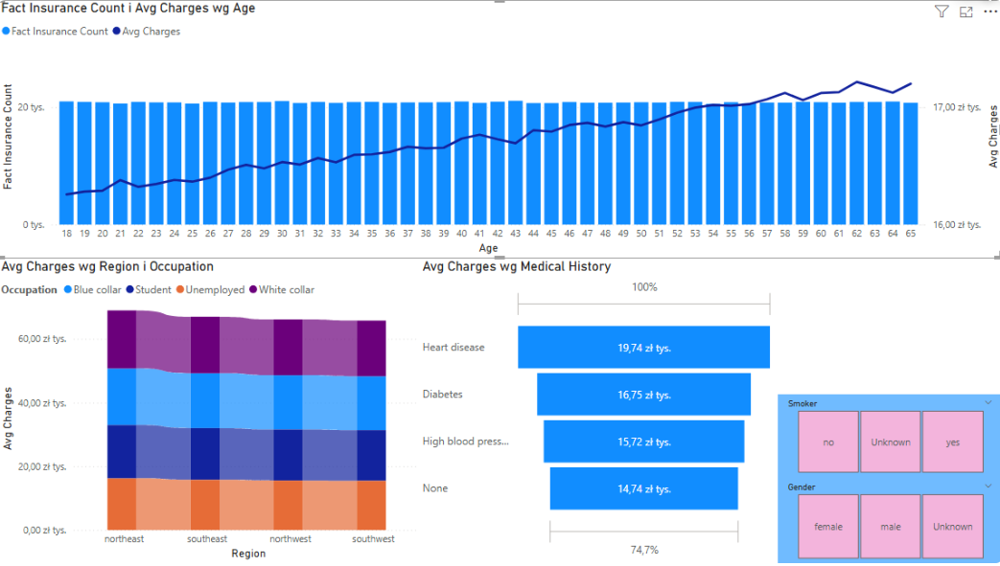

# Analiza Danych Ubezpieczeniowych & Dashboard BI

## Opis projektu
Projekt analityczny obejmujący pełen cykl życia danych: od ekstrakcji, czyszczenia i transformacji (ETL), przez budowę wielowymiarowej kostki OLAP oraz modeli Data Mining, aż po wizualizację kluczowych wskaźników efektywności (KPI) w Power BI. Celem projektu było stworzenie zaawansowanego narzędzia wspomagania decyzji menedżerskich dotyczących rentowności polis oraz szacowania ryzyka medycznego na zbiorze ponad 1 mln rekordów.

Projekt zrealizowany w ramach studiów na Politechnice Rzeszowskiej (Kierunek: Inżynieria i Analiza Danych).

## Technologie i narzędzia
* **Wizualizacja:** Power BI, DAX (tryb *Connect Live*)
* **Hurtownie danych & Kostki OLAP:** SQL Server, SSAS (SQL Server Analysis Services), MDX
* **Procesy ETL:** SSIS (SQL Server Integration Services)
* **Inżynieria danych / AI:** SSAS Data Mining (Drzewa Decyzyjne, Sieci Neuronowe, Analiza Skupień), język DMX
* **Język zapytań:** T-SQL

## Architektura i proces
1.  **Czyszczenie i integracja danych (ETL):** Pobranie surowych danych i przygotowanie ich do analizy w SSIS przy użyciu zaawansowanego czyszczenia tekstowego (*Fuzzy Lookup*) oraz obsługi błędów.
2.  **Modelowanie OLAP & Data Mining:** Zaprojektowanie struktury wymiarów (w schemacie gwiazdy) i miar w SSAS oraz implementacja algorytmów predykcyjnych do prognozowania kosztów i ryzyka.
3.  **Wizualizacja:** Utworzenie interaktywnego dashboardu dla kadry zarządzającej połączonego bezpośrednio z kostką analityczną.

## Podgląd Dashboardu

### 1. Wpływ demografii i historii medycznej na koszty ubezpieczenia
Zestawienie pokazujące korelację wieku z rosnącymi kosztami, walidację skuteczności modeli AI (sieci neuronowych i drzew decyzyjnych) oraz rozkład opłat w zależności od przebytych chorób, wskaźnika BMI i nałogów (palenie tytoniu).

<kbd>
  
</kbd>

---
