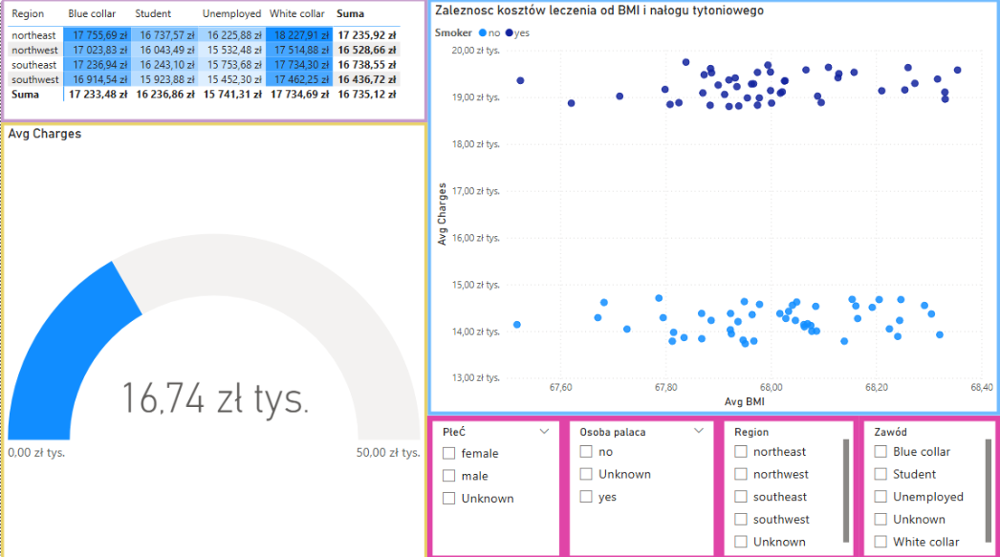
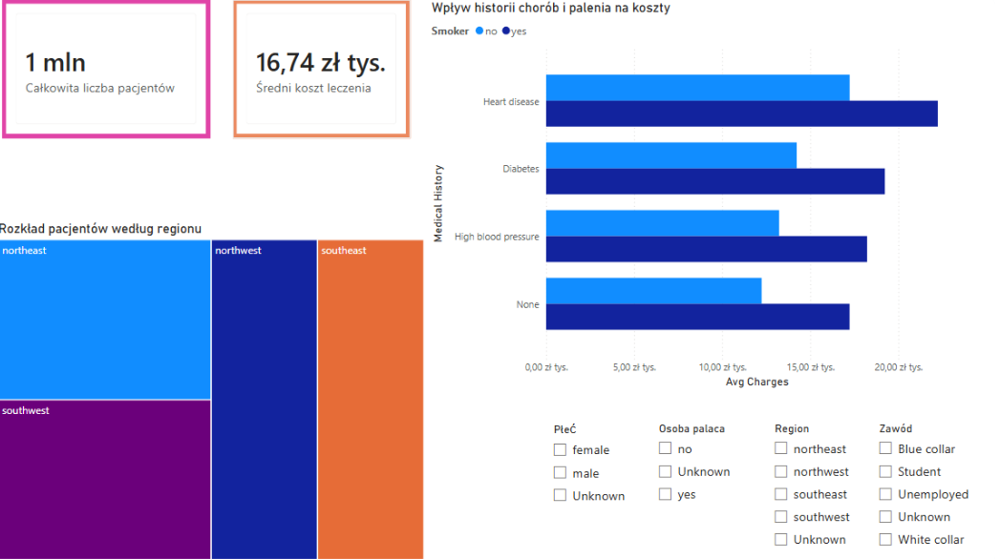
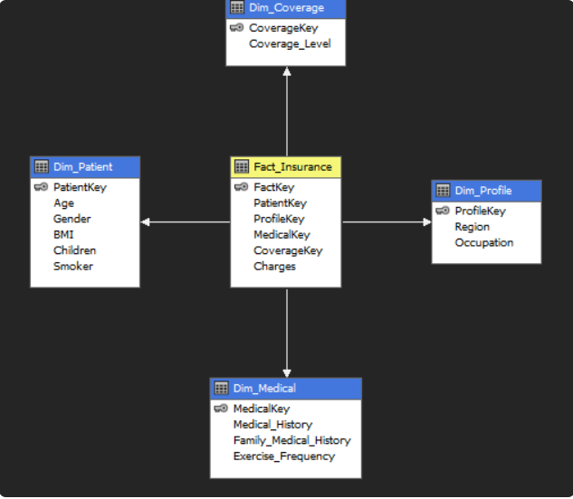
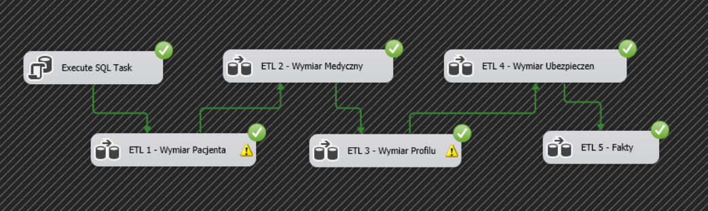
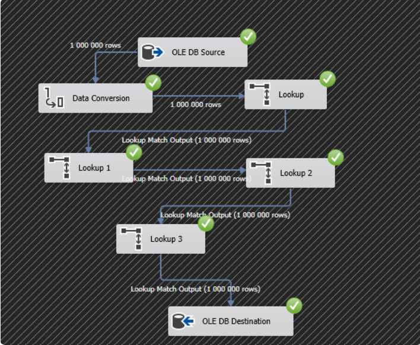
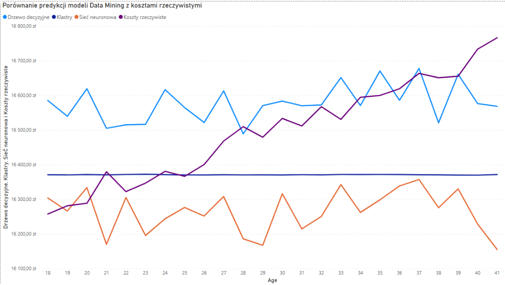

# Analiza danych ubezpieczeniowych & Dashboard BI

## Opis projektu
Projekt analityczny obejmujący pełen cykl życia danych: od ekstrakcji i transformacji (ETL), przez budowę wielowymiarowej kostki OLAP, aż po wizualizację kluczowych wskaźników efektywności (KPI) w Power BI. Celem było stworzenie narzędzia wspierającego decyzje menedżerskie dotyczące rentowności polis.

Projekt zrealizowany w ramach studiów na Politechnice Rzeszowskiej (Kierunek: Inżynieria i Analiza Danych).

## Technologie i narzędzia
* **Wizualizacja:** Power BI, DAX
* **Hurtownie danych:** Architektura OLAP, procesy ETL, Power Query, SSAS, SSIS
* **Język zapytań:** SQL / T-SQL

## Architektura i proces
1. **Czyszczenie danych (ETL):** Pobranie surowych danych i przygotowanie ich do analizy.
2. **Modelowanie OLAP:** Zaprojektowanie struktury wymiarów i miar kluczowych dla biznesu.
3. **Wizualizacja:** Utworzenie interaktywnego dashboardu dla kadry zarządzającej.

---

## Podgląd dashboardu

### 1. Wpływ demografii i historii medycznej na koszty ubezpieczenia
Zestawienie pokazujące korelację wieku z rosnącymi kosztami oraz rozkład opłat w zależności od przebytych chorób i regionu zamieszkania.

<kbd>
  
</kbd>

### 2. Zależność kosztów leczenia od BMI i nałogu tytoniowego
Szczegółowa analiza (wykres punktowy) udowadniająca drastyczny wzrost kosztów leczenia u osób palących, połączona ze szczegółową macierzą kosztów dla poszczególnych zawodów.

<kbd>
  
</kbd>

### 3. Główne wskaźniki KPI i rozkład regionalny
Widok podsumowujący z najważniejszymi metrykami biznesowymi (całkowita liczba pacjentów, średni koszt leczenia), mapą drzewa dla regionów oraz wpływem chorób współistniejących na wysokość opłat.

<kbd>
  
</kbd>

---

## Architektura danych i proces ETL (SSIS)
Projekt to nie tylko wizualizacja, ale pełen proces zasilania hurtowni danych, zrealizowany przy pomocy narzędzi klasy Enterprise.

### 1. Modelowanie danych (Schemat Gwiazdy)
Zaprojektowałam strukturę hurtowni danych w klasycznym modelu gwiazdy. Centralną osią jest tabela faktów (`Fact_Insurance`), otoczona tabelami wymiarów (m.in. `Dim_Patient`, `Dim_Medical`, `Dim_Coverage`), co zapewnia optymalizację pod kątem zapytań analitycznych.

<kbd>
  
</kbd>

### 2. Architektura procesu ETL (Control Flow)
Zbudowałam zautomatyzowany rurociąg danych (pipeline). Zachowałam rygorystyczną kolejność ładowania (najpierw wymiary, na końcu tabela faktów), z obsługą błędów i weryfikacją wykonania zadań.

<kbd>
  
</kbd>

### 3. Transformacja i zasilanie milionami rekordów (Data Flow)
Proces zasilania tabeli faktów sprawnie przetwarza zbiory rzędu 1 000 000 rekordów. Wykorzystałam m.in. transformacje typu *Lookup* do poprawnego mapowania kluczy biznesowych na klucze zastępcze (Surrogate Keys) w hurtowni.

<kbd>
  
</kbd>

---

## Zaawansowana analityka i data mining
Projekt został rozszerzony o wykorzystanie algorytmów uczenia maszynowego do przewidywania kosztów leczenia.

### Porównanie modeli predykcyjnych
Zestawienie predykcji stworzonych za pomocą Drzew Decyzyjnych, Klastrowania oraz Sieci Neuronowych z rzeczywistymi kosztami, w podziale na wiek pacjenta.

<kbd>
  
</kbd>

---

